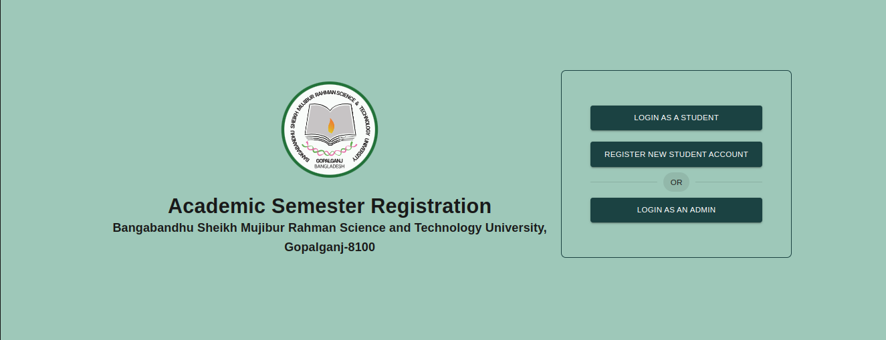

# `Academic Semester Registration` - Bangabandhu Sheikh Mujibur Rahman Science and Technology University

### **_Live Site_**: https://bsmrstu-8100.vercel.app

`Introduction:` The Bangabandhu Sheikh Mujibur Rahman Science and Technology University Semester Registration System/Semester Form Fill-Up is a web application designed to streamline and simplify the semester registration process within the university. This system role-based access controls distinct responsibilities of Super Admin, Chairmen, Students, and Hall Operators organized workflow. By integrating key features and functionalities, this system aims to enhance the overall management of semester-related tasks, providing a user-friendly experience for all stakeholders involved. This web application reduces student's hassles and it can be done with very less paper works. And minimize the work process that a student can fill up the semester form from his/her devices.

### Role Base Access Control:

- `Super Admin` – Have access to all data
  - Create a new faculty
  - Create a new department
  - Create a new subject
  - Retrieve all faculties, departments, and subjects
  - Only the Super Admin can create a new Role as like (Chairman, Office Operator, or Hall Operator)
- `Chairman `(Individual Department)
  - When a student submits their form to attend the semester exam with all the information, then the form will be visible in the chairman’s dashboard. If the student is eligible to attend the semester exam then the Chairman can approve the form, otherwise, the Chairman can decline or Hold the form and can leave any message as to why the form is declined or hold.
  - Retrieve all forms of the semester which are submitted of his/her department
- `Student`
  - Register a new account and login to their account
  - View profile, dashboard, registered semester.
  - Generate new receipt of semester fee to make payment.
  - Can register new a semester as a regular semester, retake, and improvement exam
  - After the form fill-up of the semester, if the chairman approves his/her form then he/she will be able to payment of the semester fee otherwise he will see the messages of the chairman about what he leaves at the time of decline of hold.
  - Can pay the semester fee using mobile payment methods and after the payment is done, the form will submitted to his/her Hall Operator.
  - When the Chairman and Hall Operator approve the semester form a generated Admit Card will be visible in the student dashboard
- `Hall Operator` (Individual Hall)
  - Receive the form and payment receipt
  - If the student is a resident of that hall he will check whether the fee of the hall is paid or not. If the Hall Operator sees that all payments have been done then he can approve. Otherwise, he can hold the form and leave a message about why the form is held.

# Features or Working Procedure

1. Super Admin Actions:
   - Create New Faculty:
     - Log in as Super Admin.
     - Navigate to the Admin Dashboard.
     - Select the option to create a new faculty.
     - Input necessary details and confirm the creation.
   - b. Create New Department:
     - Access the Admin Dashboard.
     - Choose the option to create a new department.
     - Enter the relevant information and finalize the creation.
   - Create New Subject:
     - From the Admin Dashboard, select the option to add a new subject.
     - Input subject details and complete the creation process.
   - Create New Role:
     - Only accessible to Super Admin.
     - Navigate to the Role Management section.
     - Define a new role (e.g., Chairman, Office Operator, Hall Operator).
   - Retrieve Information:
     - Super Admin can view all faculties, departments, and subjects from the Admin Dashboard.
2. Chairman Actions:

   - Log in as Chairman.
   - Access the Chairman Dashboard to view forms submitted for their department.
   - Approve/Reject/Hold Forms:
   - Evaluate each form for eligibility.
   - Approve, reject, or place a form on hold.
   - Leave a message if necessary.
   - Review Semester Forms.

3. Student Actions:

   - Register Account and Login:
     - Register a new account with the necessary details.
     - Log in using the created credentials.
   - View Profile and Dashboard:
     - Access the user dashboard to view personal details and overall progress.
   - Register for Semesters:
     - Choose semester type (regular, retake, improvement).
     - Complete the form fill-up process.
   - Generate Semester Fee Receipt: Generate a receipt for the semester fee.
   - Admit Card Generation: If the Chairman and Hall Operator approve the form, the Admit Card is automatically generated and visible in the dashboard.

4. Hall Operator Actions:
   a. Receive Forms and Payments:
   - Log in as a Hall Operator.
   - Receive semester forms and payment receipts.
     b. Validate Hall Fee Payments:
   - Check if the student is a resident of the hall.
   - Verify that all hall-related fees are paid.
     c. Approve/Hold Forms: -
   - Approve the form if all payments are made.
   - Hold the form if any payments are due and leave a message explaining the hold.

# Tech Stacks:

### Client-Side

- TypeScript – programming language
- React.js –Javascript library to create web user interfaces
- Redux-toolkit – state management tools
- MUI – Component library

### Server Side

- TypeScript – programming language
- Node.js – run time
- Express.js – a web framework of node.js
- Mongodb – NoSQL database
- Mongoose – ODM of mongoDB

**_Project Start - 31 December, 2023_**
